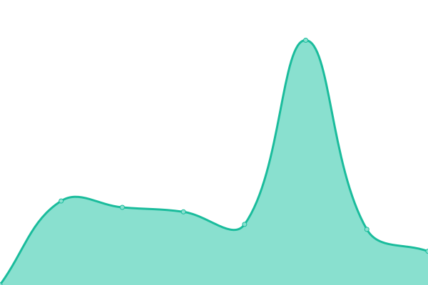
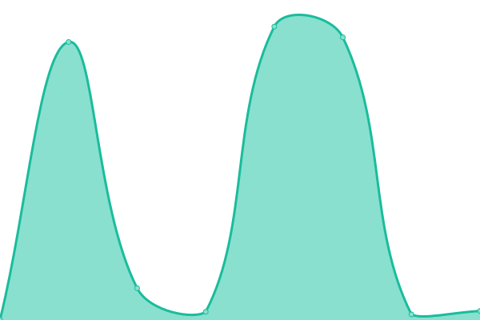
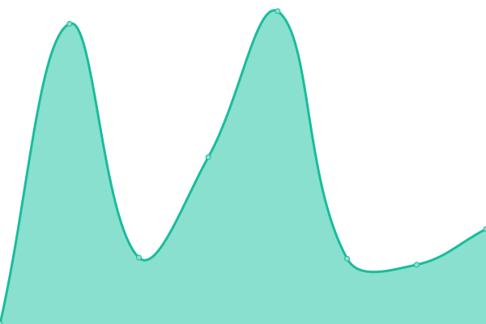

# [📈 Live Status](https://upptime.github.io/upptime): <!--live status--> **🟩 All systems operational**

This repository contains the open-source uptime monitor and status page for [Upptime](https://upptime.js.org), powered by [Upptime](https://github.com/upptime/upptime).

With [Upptime](https://upptime.js.org), you can get your own unlimited and free uptime monitor and status page, powered entirely by a GitHub repository. We use [Issues](https://github.com/upptime/upptime/issues) as incident reports, [Actions](https://github.com/jonesyriffic/gsp-eu/actions) as uptime monitors, and [Pages](https://upptime.github.io/upptime) for the status page.

<!--start: status pages-->
<!-- This summary is generated by Upptime (https://github.com/upptime/upptime) -->
<!-- Do not edit this manually, your changes will be overwritten -->
<!-- prettier-ignore -->
| URL | Status | History | Response Time | Uptime |
| --- | ------ | ------- | ------------- | ------ |
|  [NOW UK](https://help.nowtv.com/) | 🟩 Up | [now-uk.yml](https://github.com/jonesyriffic/gsp-eu/commits/HEAD/history/now-uk.yml) | 

 689ms
     
 | 

<a href="https://jonesyriffic.github.io/gsp-eu/history/now-uk">100.00%</a>
    

|  [NOW IE](https://help.nowtv.com/ie/) | 🟩 Up | [now-ie.yml](https://github.com/jonesyriffic/gsp-eu/commits/HEAD/history/now-ie.yml) | 

 414ms
     
 | 

<a href="https://jonesyriffic.github.io/gsp-eu/history/now-ie">100.00%</a>
    

|  [NOW IT](https://www.nowtv.it/assistenza/) | 🟩 Up | [now-it.yml](https://github.com/jonesyriffic/gsp-eu/commits/HEAD/history/now-it.yml) | 

 1269ms
     
 | 

<a href="https://jonesyriffic.github.io/gsp-eu/history/now-it">100.00%</a>
    

|  [WOW DE](https://www.wowtv.de/hilfe) | 🟩 Up | [wow-de.yml](https://github.com/jonesyriffic/gsp-eu/commits/HEAD/history/wow-de.yml) | 

 1327ms
     
 | 

<a href="https://jonesyriffic.github.io/gsp-eu/history/wow-de">100.00%</a>
    

|  [Sky X](https://skyx.sky.at/hilfe/) | 🟩 Up | [sky-x.yml](https://github.com/jonesyriffic/gsp-eu/commits/HEAD/history/sky-x.yml) | 

 1325ms
     
 | 

<a href="https://jonesyriffic.github.io/gsp-eu/history/sky-x">100.00%</a>
    

<!--end: status pages-->

[**Visit our status website →**](https://upptime.github.io/upptime)

## 📄 License

- Powered by: [Upptime](https://github.com/upptime/upptime)
- Code: [MIT](./LICENSE) © [Anand Chowdhary](https://anandchowdhary.com), supported by [Pabio](https://pabio.com)
- Data in the `./history` directory: [Open Database License](https://opendatacommons.org/licenses/odbl/1-0/)
